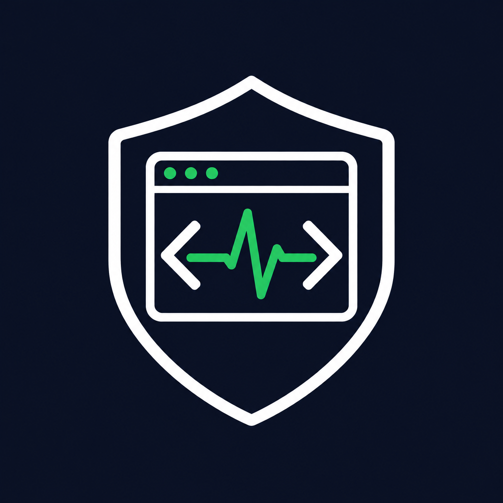
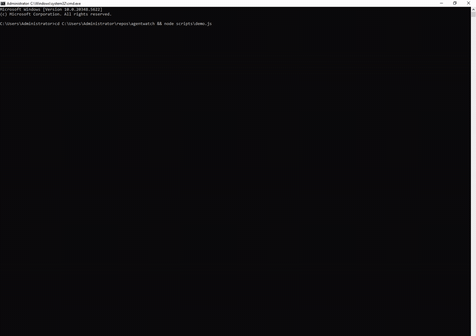

<p align="center">
  <br>
  <b>agentwatch</b><br>
  Watchdog for long-running AI coding agents
</p>

<p align="center">
  <a href="https://github.com/piemvibes-hue/agentwatch/actions/workflows/ci.yml"></a>
  
  =18">
  
</p>

**断了续，死了报。** Watchdog for long-running AI coding agents — starts with OpenAI Codex (CLI, Desktop, exec — they all share `~/.codex`).

Leave a Codex task running overnight. When the stream disconnects, the usage limit hits, the servers 429, or the thread quietly stalls, agentwatch detects it, resumes **that exact thread** through the official `codex queue` command, verifies it is actually producing work again, and pushes you a notification when it can't.

<p align="center"></p>

## How it works

Two detection layers (structured first, text as fallback):

```
~/.codex/*.sqlite    logs_2: per-thread ERROR/WARN rows → rules engine
  (if Python present) goals_1: thread_goals.status = usageLimited → /goal resume
                      state_5: threads.updated_at_ms + source → activity/verify/routing
                      thread_history_1: per-turn status — failed turns carry
                                        error_json; orphaned inProgress = died mid-run
~/.codex/sessions/**/rollout-*.jsonl   (always on — tail + tail-replay on startup)
        │  every signal → rules.json (hot-reloaded)
        ▼
  failure class → action
        │  wait_reset: extract resets_at, resume at reset+2min
        │  queue:      codex queue --thread <UUID> --message "Continue"
        │  exec-resume:codex exec resume <UUID> "Continue"   (source=exec threads)
        │  notify:     alert only        ignore: fail-closed, never retry
        ▼
  verify: new rollout/log/thread activity within 5min → recovered ✓
        │  nothing → retry (max 3) → still nothing → "GAVE UP" notification
```

- **No GUI automation, no PTY wrapping, no guessing `--last`.** Recovery auto-routes per thread `source`: interactive/Desktop threads get `codex queue --thread <uuid>` (the official in-app injection); headless `exec` threads get `codex exec resume <uuid>` which re-executes a turn in a fresh process. Override with `recoveryMethod: "queue"|"exec-resume"` in rules.json. If a `queue` attempt produces no activity within the verify window — the message was never consumed, i.e. no surface holds the thread — `auto` mode falls back to `exec resume` for the retry instead of burning all attempts on an unread mailbox.
- **Fail-closed.** Only named failures are retried (stream disconnect, 429, overload, 5xx, timeout, usage limit, stall). Permanent config errors (`model_not_found`, bad API key, frozen account) alert you instead of burning retries; user cancellations and content-policy stops are never touched.

*Verified on real codex-cli 0.161.0 + Windows Server 2022: a killed exec turn was detected as an orphaned `inProgress` row, revived via `codex exec resume` to a real `completed` turn, and marked recovered on next poll. `codex queue` was confirmed to land in `queue_1.sqlite` (delivered only while a surface holds the thread open).*
- **Pre-existing corpses are detected too.** On startup agentwatch inspects the tail of every rollout file — a thread that died at 3 AM is found when you launch the watchdog at 8 AM.
- **State persists** in `~/.agentwatch/state.json` — restart-safe schedules.

## Usage

```bash
# requires Node 18+, and `codex` on PATH (ships with Codex CLI / Desktop)

node src/cli.js watch                      # run the watchdog
node src/cli.js watch --ntfy my-topic      # + push notifications via ntfy.sh
node src/cli.js watch --webhook https://…  # + POST {text,title,detail} JSON
node src/cli.js watch --dry-run            # detect & schedule, never execute
node src/cli.js scan                       # one-shot status table
node src/cli.js status                     # persisted watchdog state
```

First real-world run on your machine:

```bash
node src/cli.js watch --dry-run --verbose
```

Keep it on for a day and check the log — it shows every rollout line's rule verdict without touching anything. When it looks right, drop `--dry-run`.

Using a custom provider (API relay) instead of a ChatGPT login — `~/.codex/config.toml`:

```toml
model = "your-model"
model_provider = "relay"

[model_providers.relay]
name = "relay"
base_url = "https://your-relay/v1"
env_key = "YOUR_RELAY_KEY_ENV"   # export the key in the same env that runs codex + agentwatch
wire_api = "responses"           # codex ≥0.160 dropped the chat wire api
```

`codex exec resume` inherits the env from the agentwatch process — keep the key exported in whatever session runs the watchdog.

**Autostart on Windows** (survives logout/reboot for overnight runs):

```powershell
schtasks /create /tn agentwatch /tr "node C:\path\to\agentwatch\src\cli.js watch" /sc onlogon /rl limited
```

## Detection coverage (rules.json)

| failure | examples matched | action |
|---|---|---|
| `usage_limit` | "hit your usage limit", "try again at 6:34 AM" | extract reset time → queue at reset + 2min (fallback 1h) |
| `stream_disconnected` | "stream disconnected before completion", transport/decode errors | queue "Continue" after 5s |
| `server_overload` | "servers are currently overloaded", "model is at capacity" | queue, 60s × 2^attempts |
| `rate_limit_429` | "429 Too Many Requests", "exceeded retry limit" | queue after 60s |
| `goal_usage_limited` | `"status":"usageLimited"` (durable Goal frozen) | queue `/goal resume` |
| `server_error_5xx`, `timeout` | 5xx, ETIMEDOUT, ECONNRESET | queue after 30s |
| `stall` | last event non-terminal, nothing new for 7min | queue "Continue" (12h max age) |
| `permanent_error` | `model_not_found`, invalid API key, `insufficient_quota`, frozen account | **notify** — no point retrying a config error |
| `never_retry` | user cancel, content policy, context length | **do nothing** |

Rules are plain JSON, hot-reloaded — add new Codex error wordings without restarting.

## Honest limitations

- `codex queue` delivers only while a Codex surface has the thread open (verified: the message waits in `queue_1.sqlite` until the app consumes it). Threads no surface holds — headless exec runs, everything after a restart — are revived by `codex exec resume` instead, which agentwatch picks automatically from `threads.source`.
- Codex Desktop (`OpenAI.Codex` MSIX) is an interactive GUI — it installs on Windows Server but its window may not launch there. Detection/recovery still works on the shared `~/.codex` stores; the GUI itself needs a real desktop session.
- The SQLite layer needs a `python`/`python3`/`py` on PATH (read-only `mode=ro`, WAL-safe). Without it, detection falls back to rollout tailing — same failures caught, slightly coarser.
- The rollout schema and DB table names are unofficial and drift — rules match on message text, not fixed field paths, but check `watch --verbose` after a Codex update.

## Test

```bash
node test/run.js   # 29 checks: rollout+DB detect→schedule→resume→verify→notify, fail-closed, give-up, turn-level + exec-resume routing
```

Uses a fake `codex` shim + synthetic rollouts — no Codex install needed.

## Roadmap

- [ ] Claude Code / Gemini CLI adapters (same monitor, different stores)
- [ ] `agentwatch run -- <cmd>` supervisor mode for `codex exec` / arbitrary jobs
- [ ] RunCheck integration: every recovery event reports to a run-outcome API
